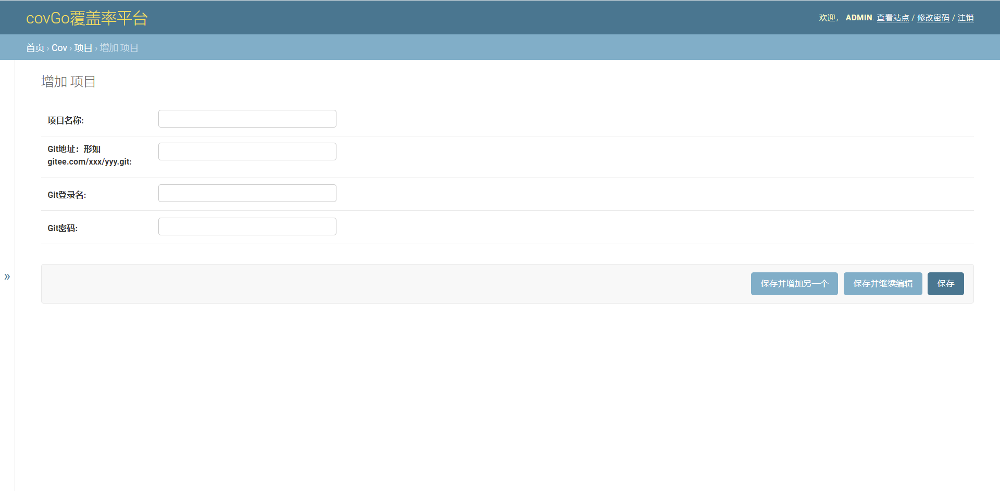
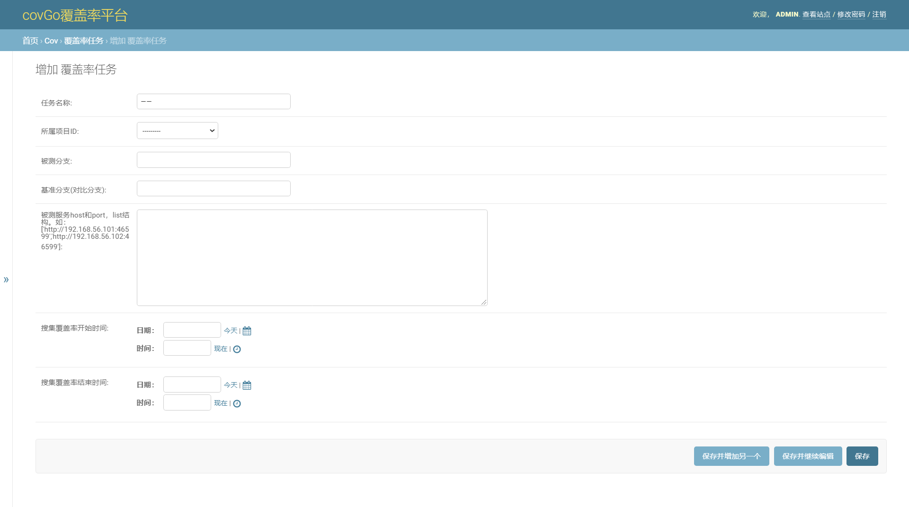
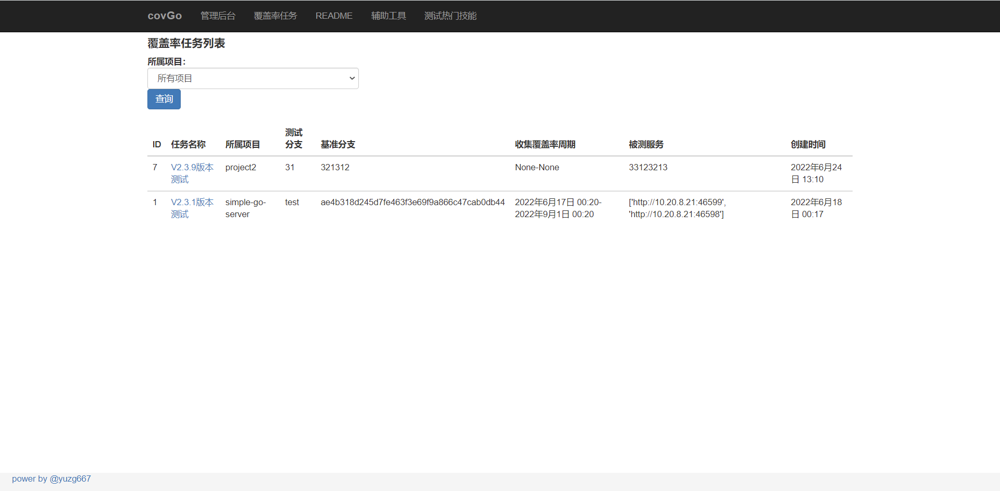
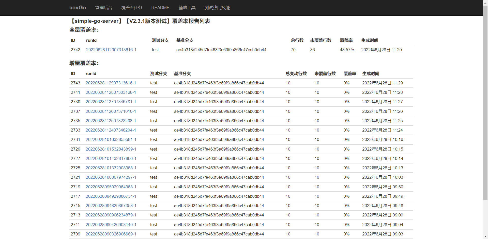
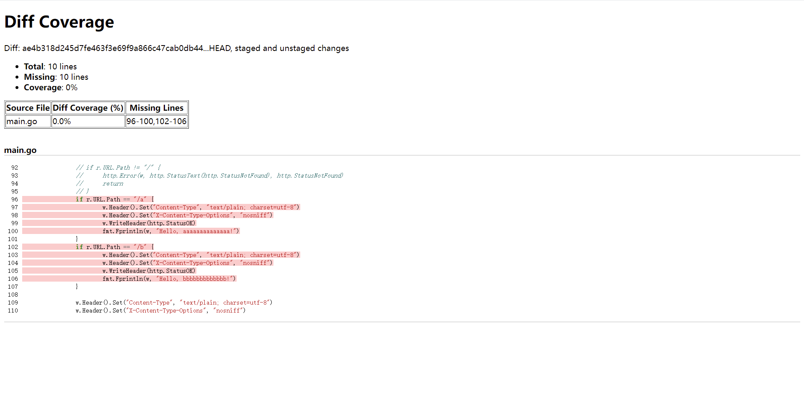

# covGo

GO语言的覆盖率平台

## 效果预览
<video id="video" controls="" preload="none">
    <source id="mp4" src="doc/2022-06-24-16-09-41.mp4" type="video/mp4">
</video>

## 环境要求
系统：支持docker的系统

## 安装(已ubuntu为例)
### coGo服务端安装 - Docker方式
1、编译
```
sudo docker build --no-cache -t "yuzg667/covgo" .
```
若不想编译，可从下网盘下载已经编译好的镜像直接使用
```
链接: https://caiyun.139.com/m/i?185C6wSTI8TXU  
提取码:ZZCb
```

2、开启容器
```
sudo docker run -d --name covgo -p 8899:8899 -p 7777:7777 yuzg667/covgo
```
3、进入docker，开启covGo服务
```
sudo docker exec -it bash 
python3 /home/workspace/covGo/manage.py runserver 0.0.0.0:8899 > /home/workspace/covgo.log
```
### 被测服务器
1、安装goc
```
# Mac/AMD64
curl -s -L "https://github.com/qiniu/goc/releases/latest" | sed -nE 's!.*"([^"]*-darwin-amd64.tar.gz)".*!https://github.com\1!p' | xargs -n 1 curl -L  | tar -zx && chmod +x goc && mv goc /usr/local/bin

# Linux/AMD64
curl -s -L "https://github.com/qiniu/goc/releases/latest" | sed -nE 's!.*"([^"]*-linux-amd64.tar.gz)".*!https://github.com\1!p' | xargs -n 1 curl -L  | tar -zx && chmod +x goc && mv goc /usr/local/bin

# Linux/386
curl -s -L "https://github.com/qiniu/goc/releases/latest" | sed -nE 's!.*"([^"]*-linux-386.tar.gz)".*!https://github.com\1!p' | xargs -n 1 curl -L  | tar -zx && chmod +x goc && mv goc /usr/local/bin

```
安装后命令行输入goc，查看是否有效。

2、进入go项目的根目录，使用goc编译打包：
```
goc build --center=http://10.200.8.210:7777 --agentport=:46599
```
备注：`--center=`的值为goc服务ip端口； `--agentport=`的值为被测服务外露的端口


## 使用
covGo平台页面

1、新建项目



2、新建覆盖率任务



3、等待覆盖率任务，进入页面查看结果





## Related tools and services

[goc](https://github.com/qiniu/goc):
goc is a comprehensive coverage testing system for The Go Programming Language, especially for some complex scenarios, like system testing code coverage collection and accurate testing.

[gocov](https://github.com/axw/gocov):
Coverage reporting tool for The Go Programming Language

[gocov-html](https://github.com/matm/gocov-html):
A simple helper tool for generating HTML output from gocov.

[gocov-xml](https://github.com/AlekSi/gocov-xml):
A simple helper tool for generating XML output in Cobertura format for CIs like Jenkins and others from gocov. 
